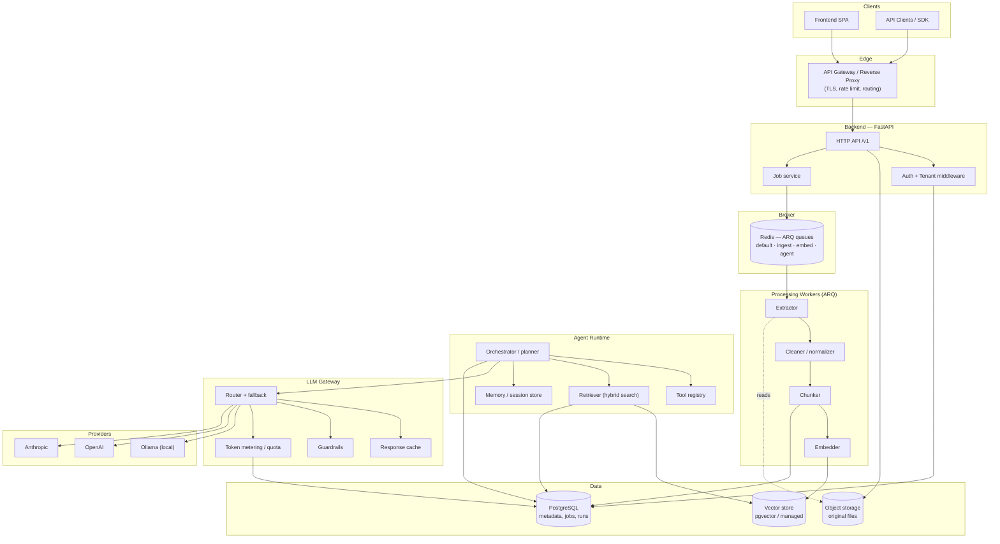
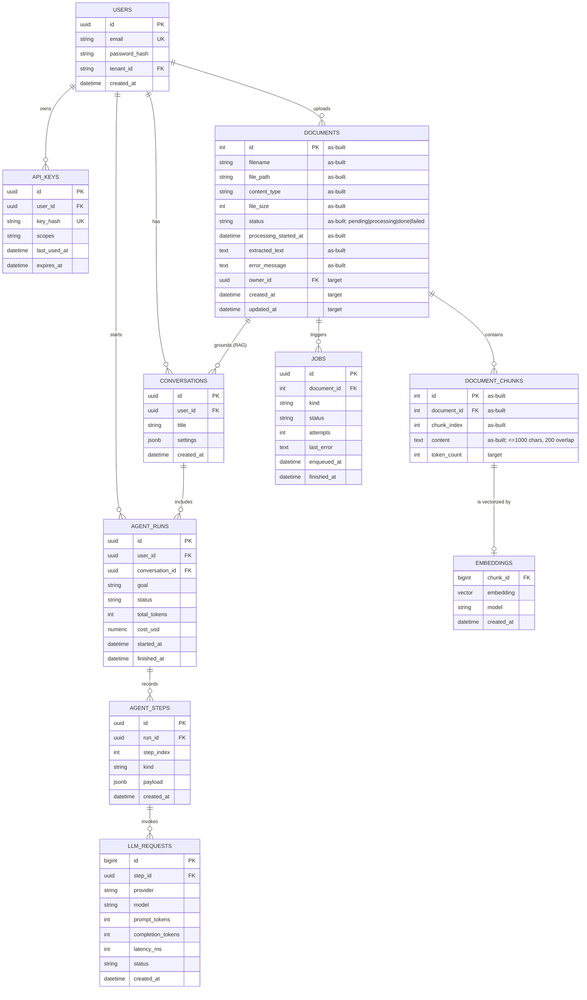
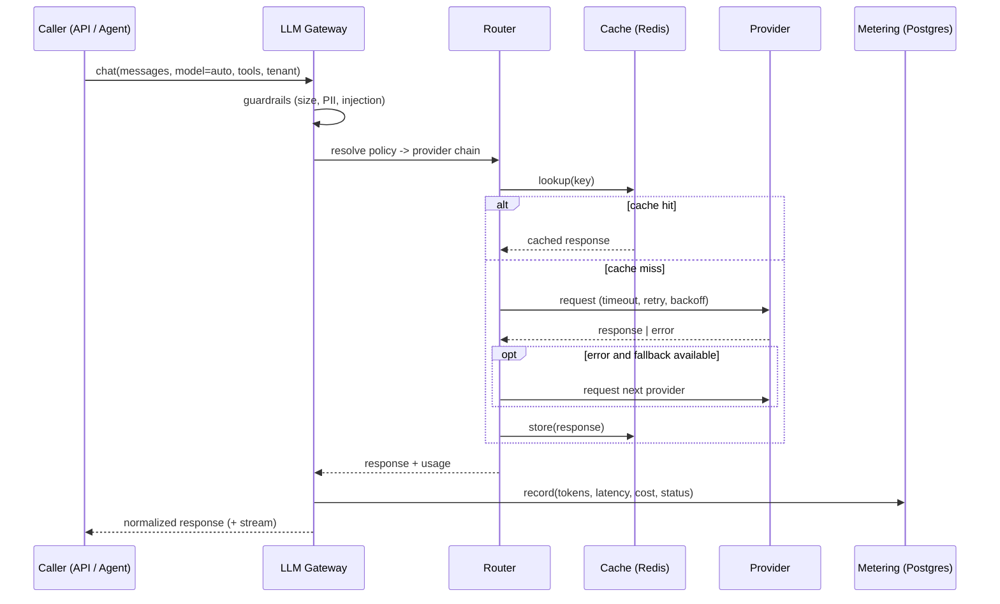
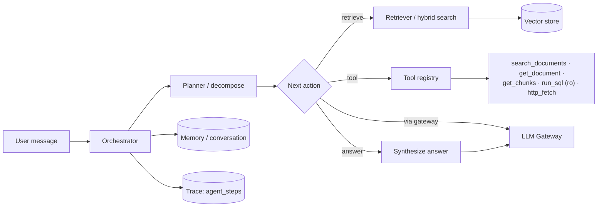

# Document Processing Platform — Architecture & Design

| | |
|---|---|
| **Status** | Design document — as-built plus target |
| **Scope** | `document-pipeline/` (this project) and the platform it grows into |
| **Audience** | Contributors, reviewers, and operators of the pipeline |
| **Version** | 2.0 |
| **Related** | [`README.md`](./README.md) · [`../README.md`](../README.md) |

This document first describes the system **as it is built today**, then specifies the **target
architecture** the project should evolve into. Every section states which of the two it is
describing.

---

## Table of contents

- [1. Overview](#1-overview)
  - [1.1 Current state (as-built)](#11-current-state-as-built)
  - [1.2 Target architecture](#12-target-architecture)
  - [1.3 Design principles](#13-design-principles)
- [2. Repository & Deployment Layout](#2-repository--deployment-layout)
- [3. Data Model](#3-data-model)
- [4. API Design](#4-api-design)
  - [4.1 Conventions (auth & versioning)](#41-conventions-auth--versioning)
  - [4.2 Resource catalog](#42-resource-catalog)
  - [4.3 Pagination & filtering](#43-pagination--filtering)
  - [4.4 Error format](#44-error-format)
- [5. Services & Agent Architecture](#5-services--agent-architecture)
  - [5.1 Service decomposition](#51-service-decomposition)
  - [5.2 Document pipeline flow](#52-document-pipeline-flow)
  - [5.3 LLM gateway](#53-llm-gateway)
  - [5.4 Agent runtime](#54-agent-runtime)
- [6. Phased Roadmap](#6-phased-roadmap)
- [7. Technology Decisions](#7-technology-decisions)
- [8. Appendices](#8-appendices)
  - [8.1 Glossary](#81-glossary)
  - [8.2 As-built file reference](#82-as-built-file-reference)
  - [8.3 Open questions](#83-open-questions)

---

## 1. Overview

### 1.1 Current state (as-built)

The system today is a compact pipeline: an HTTP API records uploads and enqueues work, and one or
more worker processes do the heavy lifting asynchronously.

| Concern | As built |
|---|---|
| HTTP API | **FastAPI** (`main.py`) with a Redis pool opened in the app lifespan |
| Background work | **ARQ** worker (`worker.py`) over **Redis** at `127.0.0.1:6379` |
| Processing | `processing_service.process_document` — claim → extract → clean → chunk → persist |
| Persistence | **SQLAlchemy 2 (async)** + **aiosqlite** (`docs.db`), migrated with **Alembic** |
| Extraction | `pypdf` (PDF) and `python-docx` (DOCX) |
| Recovery | `recpver_stale_jobs.py` resets documents stuck in `processing` for > 15 min |

**Document lifecycle:** `pending → processing → done`, or `→ failed`. A `failed` document is
eligible for re-claim (`status IN ("pending", "failed")`), which makes retries idempotent.

```mermaid
flowchart LR
    Client["Client"] -->|POST /documents/upload| API["FastAPI<br/>main.py"]
    API -->|store file| Disk[("uploads/")]
    API -->|record row| DB[("SQLite<br/>docs.db")]
    API -->|enqueue job| Redis[("Redis<br/>ARQ queue")]
    Redis --> Worker["ARQ worker<br/>worker.py"]
    Worker -->|claim, extract,<br/>clean, chunk| DB
    Worker -->|read file| Disk
    Client -->|GET /documents/{id}/chunks| API
    API -->|read| DB
```

### 1.2 Target architecture

The target keeps the same shape — **stateless HTTP, asynchronous workers, one storage tier** — but
grows each responsibility into an independently scalable component behind a single LLM gateway.



### 1.3 Design principles

1. **Stateless HTTP, stateful workers** — the API never blocks on CPU/IO-heavy work; it returns
   `202 Accepted` and lets clients poll or subscribe.
2. **One writer per document** — the atomic claim (`UPDATE … WHERE status IN (…)`) guarantees
   at-most-once processing per attempt, even with N worker replicas.
3. **Storage is the source of truth** — Postgres for relational state, object storage for blobs, the
   vector store for embeddings; Redis only brokers work.
4. **Idempotency by default** — re-running a job deletes and rebuilds chunks/embeddings rather than
   appending, so retries and replays are safe.
5. **Everything through the gateway** — no service calls a model provider directly; all LLM calls
   pass the [gateway](#53-llm-gateway) for routing, cost, safety, and observability.

---

## 2. Repository & Deployment Layout

> `document-pipeline/` is currently a **standalone project** in a collection of independent
> projects (see the [root README](../README.md)). The layout below is the **target** structure for
> when the pipeline is promoted into its own deployable repository — the as-built files map into it
> one-to-one without a logic rewrite.

```text
document-processing-platform/
├── frontend/                     # SPA: upload, document browser, chat/agent console
│   └── src/
│       ├── features/{documents,search,agents}/
│       ├── components/
│       └── lib/                  # typed API client (generated from OpenAPI)
│
├── backend/                      # FastAPI service + workers (this project lives here)
│   ├── app/
│   │   ├── api/v1/               # documents · search · agents · health
│   │   ├── core/                 # config · security · logging · errors
│   │   ├── models/               # SQLAlchemy ORM
│   │   ├── schemas/              # Pydantic request/response
│   │   ├── services/             # processing · embedding · retrieval · agent
│   │   ├── pipeline/             # extractor · text_cleaner · chunks
│   │   ├── llm/                  # gateway: router · providers · cache · metering
│   │   ├── queue/                # redis_queue · worker · cron
│   │   └── db/                   # database · session factory
│   ├── alembic/                  # migrations
│   ├── tests/
│   ├── pyproject.toml
│   └── alembic.ini
│
├── infra/                        # deployment & environments
│   ├── docker/{api,worker,frontend}.Dockerfile
│   ├── compose/                  # api · worker · redis · postgres · minio · frontend
│   ├── k8s/                      # manifests/Helm: deployments, HPA, ingress, secrets
│   ├── terraform/                # managed PG, object store, vector store
│   ├── observability/            # otel · prometheus · grafana · loki
│   └── ci/
│
├── docs/                         # design docs, API reference, ADRs, runbooks
│   ├── ARCHITECTURE.md
│   ├── api/
│   ├── diagrams/                 # .mmd sources
│   ├── adr/
│   └── runbooks/
│
├── packages/                     # shared, versioned libraries
│   ├── sdk-python/               # generated typed client
│   └── contracts/                # OpenAPI + event schemas
│
├── .github/workflows/            # lint · test · build · migrate · deploy
├── Makefile
└── README.md
```

**As-built → target mapping**

| As-built (this folder) | Target |
|---|---|
| `main.py` | `backend/app/api/v1/documents.py` + `backend/app/main.py` |
| `models.py` / `schemas.py` | `backend/app/models/` · `backend/app/schemas/` |
| `database.py` | `backend/app/db/database.py` |
| `processing_service.py` | `backend/app/services/processing_service.py` |
| `extractor.py` · `text_cleaner.py` · `chunks.py` | `backend/app/pipeline/` |
| `worker.py` · `redis_queue.py` | `backend/app/queue/` |
| `recpver_stale_jobs.py` | `backend/app/queue/cron.py` |
| `alembic/` · `alembic.ini` | `backend/alembic/` · `backend/alembic.ini` |
| `enqueue_test.py` · `reset_test_document.py` · `test_processing_service.py` | `backend/tests/` · `backend/scripts/` |

---

## 3. Data Model

Entities marked **(as-built)** exist today; the rest are the target additions.



**Constraints and gaps to close**

| Table | Today | Target |
|---|---|---|
| `documents` | no owner, no timestamps | add `owner_id`, `created_at`, `updated_at` |
| `document_chunks` | no index on `document_id`, no cascade, no uniqueness | index `document_id`; `ON DELETE CASCADE`; `UNIQUE(document_id, chunk_index)` |
| `embeddings` | — | `pgvector` column; dimension fixed per embedding model |
| `jobs` | implicit (`processing_started_at`) | job state explicit and queryable |

---

## 4. API Design

### 4.1 Conventions (auth & versioning)

**Versioning.** All routes are prefixed with `/v1`. Breaking changes ship as `/v2`; additive changes
ship in place. Deprecations carry `Deprecation` and `Sunset` headers for at least one minor release.
The OpenAPI schema is exported to `docs/api/openapi.json` in CI, and the Python SDK is generated
from it.

**Auth** is layered, applied left to right:

| Layer | Mechanism |
|---|---|
| Transport | TLS terminated at the gateway; HSTS; no plaintext |
| Authentication | `Authorization: Bearer <token>` — either a **JWT** (users) or an **API key** (`dps_live_…`, stored hashed) |
| Authorization | Every query scoped by `owner_id`/`tenant_id`; scopes (`documents:read`, `documents:write`, `agents:run`) gate endpoints |

> **As-built:** there is **no auth** — endpoints are open. Auth lands in
> [Phase 1](#6-phased-roadmap); until then the API must not accept public traffic.

### 4.2 Resource catalog

| Method | Path | Description | Scope | Success |
|---|---|---|---|---|
| `GET` | `/v1/health` | Liveness/readiness (DB, Redis, vector, gateway) | public | `200` |
| `POST` | `/v1/documents` | Create metadata-only record | `documents:write` | `201` |
| `GET` | `/v1/documents` | List documents (filter, sort, cursor) | `documents:read` | `200` |
| `GET` | `/v1/documents/{id}` | Get one document | `documents:read` | `200` |
| `PATCH` | `/v1/documents/{id}` | Partial update (filename, status) | `documents:write` | `200` |
| `DELETE` | `/v1/documents/{id}` | Delete document + chunks + blobs | `documents:write` | `204` |
| `POST` | `/v1/documents/upload` | Upload file, enqueue ingest job | `documents:write` | `202` |
| `POST` | `/v1/documents/{id}/reprocess` | Re-queue a `done`/`failed` document | `documents:write` | `202` |
| `GET` | `/v1/documents/{id}/chunks` | List chunks by `chunk_index` | `documents:read` | `200` |
| `GET` | `/v1/documents/{id}/jobs` | Job history for a document | `documents:read` | `200` |
| `GET` | `/v1/jobs/{id}` | Job status/detail | `documents:read` | `200` |
| `POST` | `/v1/search` | Hybrid/semantic search over chunks | `documents:read` | `200` |
| `POST` | `/v1/conversations` | Create a conversation | `agents:run` | `201` |
| `POST` | `/v1/conversations/{id}/messages` | Send message (SSE stream) | `agents:run` | `200` |
| `GET` | `/v1/agents/runs` | List agent runs | `agents:run` | `200` |
| `GET` | `/v1/agents/runs/{id}` | Run detail + steps + cost | `agents:run` | `200` |
| `POST` | `/v1/agents/runs/{id}/abort` | Cancel a running agent | `agents:run` | `202` |

**As-built subset** (in `main.py`, currently unversioned and unauthenticated):
`POST /documents`, `GET /documents`, `GET /documents/{id}`, `PATCH /documents/{id}`,
`DELETE /documents/{id}`, `POST /documents/upload`, `GET /documents/{id}/chunks`.

### 4.3 Pagination & filtering

Cursor pagination (stable under concurrent writes), not offset:

```http
GET /v1/documents?limit=50&cursor=eyJpZCI6MTIzfQ&sort=-created_at&status=done
```

```json
{ "items": [ /* ... */ ], "next_cursor": "eyJpZCI6MTIzfQ", "has_more": true }
```

- `limit` — default `50`, max `200`; `cursor` — opaque base64url of the last sort key.
- `sort=field` / `sort=-field` over a whitelist.
- Filters are explicit, whitelisted query params (`status`, `content_type`, `created_after`).

### 4.4 Error format

Errors use **RFC 9457 `application/problem+json`** uniformly, produced by a single handler.

```json
{
  "type": "https://docs.example.com/problems/validation-error",
  "title": "Validation error",
  "status": 422,
  "detail": "content_type must be one of application/pdf, application/vnd.openxmlformats-officedocument.wordprocessingml.document",
  "instance": "/v1/documents/upload",
  "request_id": "01J8Z2K7Q9Y5V4N3M2P1R0T6SB",
  "errors": [
    { "field": "file", "code": "unsupported_type", "message": "Only PDF and DOCX are allowed" }
  ]
}
```

| Code | Meaning | When |
|---|---|---|
| `400` | Bad request | Missing filename, malformed body |
| `401` | Unauthorized | Missing/invalid credentials |
| `403` | Forbidden | Valid auth, insufficient scope/ownership |
| `404` | Not found | Unknown document/job/run id |
| `409` | Conflict | Illegal state transition (e.g. reprocess while running) |
| `413` | Payload too large | Upload exceeds size limit |
| `415` | Unsupported media type | Bad `content_type` |
| `422` | Unprocessable entity | Schema validation failure |
| `429` | Too many requests | Rate/quota exceeded (`Retry-After`) |
| `500` | Internal error | Unhandled server fault |
| `503` | Unavailable | Dependency down (DB/Redis/vector/gateway) |

> **As-built:** `main.py` raises bare `HTTPException(detail=…)` (mostly `400`/`404`). A single
> exception handler in `core/errors.py` will emit the shape above for all of them.

---

## 5. Services & Agent Architecture

### 5.1 Service decomposition

| Service | Responsibility | Scaling axis | Backing store |
|---|---|---|---|
| **API** | HTTP, auth, validation, enqueue | replicas (stateless) | Postgres, Redis |
| **Ingest worker** | extract → clean → chunk | queue depth | Object storage, Postgres |
| **Embedder worker** | batch-embed chunks | GPU/throughput | Vector store |
| **Agent runtime** | plan → tool calls → answer | runs in flight | Postgres, Redis, vector store |
| **LLM gateway** | one interface to all models | requests/sec | Redis cache, Postgres metering |
| **Scheduler** | stale-job recovery, reindex | singleton | Postgres, Redis |

The as-built `process_document` becomes the **ingest worker** unchanged. Embedding is split into its
own worker so CPU-bound parsing and IO/GPU-bound embedding scale independently.

### 5.2 Document pipeline flow

```mermaid
sequenceDiagram
    autonumber
    participant C as Client
    participant A as API
    participant R as Redis (ARQ)
    participant W as Worker
    participant D as Database
    participant F as File storage

    C->>A: POST /v1/documents/upload (file)
    A->>A: validate type & extension
    A->>F: store file
    A->>D: insert document (status=pending)
    A->>R: enqueue process_document_job(id)
    A-->>C: 202 Accepted {id, status=pending}
    R->>W: deliver job
    W->>D: UPDATE ... SET status=processing WHERE status IN (pending, failed)
    W->>F: read file
    W->>W: extract -> clean -> chunk
    W->>D: replace chunks; SET status=done
    C->>A: GET /v1/documents/{id}
    A->>D: read
    A-->>C: {status: done}
    C->>A: GET /v1/documents/{id}/chunks
    A-->>C: [chunks]
```

### 5.3 LLM gateway

The gateway is the **only** path to model providers. It presents one OpenAI-compatible surface and
hides provider differences.

| Responsibility | Detail |
|---|---|
| **Unified interface** | `chat(messages, model, tools, stream)` and `embed(texts, model)` |
| **Routing** | policy-based: `local-first`, `quality-first`, `cost-first`, or explicit `provider:model` |
| **Fallback & retries** | on `429`/`5xx`/timeout → exponential backoff + jitter, then fail over; circuit-break a sick provider |
| **Caching** | exact-match cache keyed by hash of (model, messages, tools, params) in Redis |
| **Quotas & metering** | per-tenant token budgets; every call writes an `llm_requests` row |
| **Guardrails** | input/output filters (PII, prompt injection), token ceilings, structured-output validation |
| **Observability** | OpenTelemetry spans with provider, model, tokens, latency, cache hit/miss, `request_id` |



```yaml
llm:
  default_policy: local-first
  policies:
    local-first:   [ollama/llama3, openai/gpt-4o-mini]
    quality-first: [anthropic/claude-sonnet, openai/gpt-4o]
    cost-first:    [openai/gpt-4o-mini, ollama/llama3]
  timeouts: { connect: 5s, read: 60s }
  retries:  { attempts: 3, backoff: exponential, base: 0.5s, jitter: true }
  cache:    { enabled: true, ttl: 3600s }
  limits:   { max_input_tokens: 32000, max_output_tokens: 4096 }
```

> The local **Ollama** integration from the sibling [`langchain/`](../langchain) learning track is
> the default development provider; the gateway formalizes what those scripts do ad hoc.

### 5.4 Agent runtime



| Component | Responsibility |
|---|---|
| **Orchestrator** | runs plan → act → observe; enforces max steps and token budget; streams events; persists each step |
| **Planner** | decomposes the goal; structured (JSON-schema) output validated by the gateway |
| **Tool registry** | declarative tools with typed schemas; destructive tools gated by human approval |
| **Retriever** | hybrid search — vector similarity (`pgvector`) + Postgres FTS, fused by reciprocal rank fusion |
| **Memory** | short-term (conversation window) + long-term (persisted summaries) |
| **Guardrails** | max steps, per-run token/cost ceiling, tool permission checks |

**Run lifecycle:** `queued → running → (succeeded | failed | aborted)`. Because every LLM call goes
through the gateway, a run's total cost is reconstructable from `llm_requests`.

---

## 6. Phased Roadmap

Each phase ships independently and is gated by its acceptance criteria (all must pass).

<details open>
<summary><strong>Phase 0 — Harden the as-built pipeline</strong></summary>

- [ ] Config is environment-driven (`pydantic-settings`); no hard-coded `127.0.0.1:6379` / `docs.db`.
- [ ] Structured JSON logging with a per-request `request_id`.
- [ ] `/health` reports DB, Redis, and worker liveness.
- [ ] Upload size limit enforced; `413` returned past the threshold.
- [ ] Stale-job recovery runs on an ARQ cron (not only as a manual script).
- [ ] Integration tests cover upload → `done` → chunks using a real Redis + temp DB.

</details>

<details>
<summary><strong>Phase 1 — Multi-tenant API</strong></summary>

- [ ] `users`, `api_keys`, `jobs` tables migrated (Alembic) with indexes + FK cascades.
- [ ] API-key + JWT auth; scopes enforced per endpoint; `401`/`403` covered by tests.
- [ ] Every document query is tenant-scoped; cross-tenant access returns `404` (not `403`).
- [ ] All endpoints versioned under `/v1`; OpenAPI exported to `docs/api/openapi.json` in CI.
- [ ] Cursor pagination + problem+json error contract implemented and documented.

</details>

<details>
<summary><strong>Phase 2 — Embeddings & hybrid search</strong></summary>

- [ ] `embeddings` table (`pgvector`) with a fixed dimension per collection.
- [ ] `embed` worker processes chunks in batches with idempotent replace-on-reprocess.
- [ ] `POST /v1/search` returns hybrid results with scores and provenance.
- [ ] Recall benchmark on a labeled set meets the agreed threshold before enabling by default.

</details>

<details>
<summary><strong>Phase 3 — LLM gateway</strong></summary>

- [ ] One `chat`/`embed` interface with Ollama + one hosted provider behind it.
- [ ] Routing policies, retries/backoff, and failover verified by fault-injection tests.
- [ ] Cache hit ratio and per-tenant token metering emitted as metrics; `llm_requests` persisted.
- [ ] Guardrails (max tokens, PII/injection checks) enforced; violations logged and counted.
- [ ] Gateway is the only component holding provider credentials (verified by config audit).

</details>

<details>
<summary><strong>Phase 4 — Agent runtime</strong></summary>

- [ ] Orchestrator runs plan → act → observe with a hard max-step and token budget.
- [ ] Tool registry with typed schemas; `search_documents` + `get_document` shipped first.
- [ ] Runs and steps persisted; `GET /v1/agents/runs/{id}` returns full trace and cost.
- [ ] Streaming answers delivered over SSE; abort stops the run within one step.
- [ ] Eval suite (task success + tool-call correctness) passes on a frozen fixture set.

</details>

<details>
<summary><strong>Phase 5 — Frontend, observability & scale</strong></summary>

- [ ] SPA: upload, document browser/chunk viewer, search, agent console with streaming.
- [ ] Traces/metrics/logs correlated by `request_id` across API, workers, gateway.
- [ ] Autoscaling on queue depth (workers) and RPS (API); load test meets latency/error SLOs.
- [ ] Runbooks for stale jobs, DLQ replay, and provider outage; backup/restore verified.

</details>

---

## 7. Technology Decisions

Each row is a candidate ADR (see the index below).

| # | Decision | Choice | Why | Alternatives considered |
|---|---|---|---|---|
| 1 | Web framework | **FastAPI** | Async-native, Pydantic validation, auto OpenAPI, minimal boilerplate | Flask, Django, Litestar |
| 2 | Async DB layer | **SQLAlchemy 2.x async + aiosqlite** | Same layer sync and async; mature; Alembic support | Tortoise ORM, asyncpg, SQLModel |
| 3 | Primary DB (target) | **PostgreSQL** | Concurrency, transactions, JSONB, FTS, `pgvector` in one place | SQLite (current), MySQL |
| 4 | Broker / worker | **Redis + ARQ** | Async-first, tiny API, matches the async app; built-in result backend | Celery, RQ, Dramatiq, SQS |
| 5 | Chunking | **Fixed-size + overlap (1000/200)** | Cheap, predictable, model-independent; good RAG baseline | Recursive/semantic splitters |
| 6 | Extraction | **pypdf + python-docx** | Pure-Python, no system deps | pdfminer, unstructured, Tesseract OCR |
| 7 | Vector store | **pgvector** (managed later) | No new datastore; transactional with metadata | FAISS, Chroma, Pinecone, Weaviate |
| 8 | Embeddings | **Local Ollama first, hosted fallback** | Zero-cost dev, offline, swap via gateway | Hosted-only, SDK-local models |
| 9 | LLM access | **Central gateway** | One place for routing, retries, cache, cost, safety, logs | Direct per-service SDK calls |
| 10 | Migrations | **Alembic** | Autogenerate from metadata; already in use | Hand-rolled SQL, Django migrations |
| 11 | Validation / schemas | **Pydantic v2** | Fast, typed, `from_attributes` bridges ORM ↔ API | dataclasses, Marshmallow |
| 12 | Repo layout | **Per-project folder + shared `packages/`** | Clear ownership, atomic cross-cutting changes | Polyrepo, per-service repos |
| 13 | API contract | **OpenAPI + generated SDK** | Single source of truth; drift caught in CI | Hand-written clients, gRPC-only |
| 14 | Error format | **RFC 9457 problem+json** | Standard, machine-readable, tooling support | Ad-hoc `{detail}` (current) |
| 15 | Diagrams-as-code | **Mermaid** | Renders in GitHub/PRs; reviewable diffs | PlantUML, draw.io |

**ADR index** (to live in `docs/adr/`): `0001` FastAPI · `0002` ARQ over Celery · `0003`
PostgreSQL + pgvector · `0004` central LLM gateway · `0005` repo layout & shared contracts · `0006`
RFC 9457 errors.

---

## 8. Appendices

### 8.1 Glossary

| Term | Meaning |
|---|---|
| **Document** | An uploaded file plus the state of its background processing |
| **Chunk** | A bounded slice of a document's extracted text (`chunk_size` 1000, `overlap` 200) |
| **Claim** | The atomic `UPDATE … WHERE status IN (pending, failed)` that assigns a document to one worker |
| **Stale job** | A document stuck in `processing` beyond `STALE_AFTER_MINUTES` (15) |
| **RAG** | Retrieval-Augmented Generation — grounding model answers in retrieved chunks |
| **Gateway** | The single service through which all LLM/provider calls flow |
| **problem+json** | The error representation defined by RFC 9457 |

### 8.2 As-built file reference

| File | Role |
|---|---|
| `main.py` | FastAPI app: CRUD, upload (`202`), chunks; ARQ pool lifespan |
| `worker.py` | ARQ `WorkerSettings` + `process_document_job` |
| `processing_service.py` | Atomic claim → extract → clean → chunk → persist |
| `redis_queue.py` | ARQ/Redis connection factory |
| `database.py` | Async engine, `SessionLocal`, `Base`, `get_db` |
| `models.py` | `Document`, `DocumentChunk` ORM models |
| `schemas.py` | Pydantic request/response models |
| `extractor.py` | PDF/DOCX text extraction |
| `text_cleaner.py` | Whitespace normalization |
| `chunks.py` | Overlapping fixed-size chunker |
| `recpver_stale_jobs.py` | Stale `processing` recovery + re-queue |
| `alembic/` | Migration environment and versions |
| `enqueue_test.py` / `reset_test_document.py` / `test_processing_service.py` | Dev helpers |

### 8.3 Open questions

1. **Storage backend** — when do uploads move from local disk to object storage (S3/MinIO)?
2. **Embedding dimension** — which model is canonical, and do we need multiple collections?
3. **Chunking strategy** — is fixed-size acceptable, or do we invest in recursive/semantic splitting?
4. **Retention** — what is the deletion/retention policy for documents, chunks, and traces?
5. **Cost controls** — per-tenant hard caps vs. soft alerts on LLM spend?
